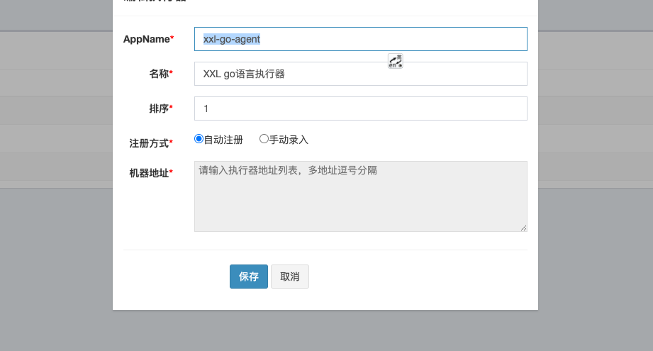

# Go xxl-job Client

xxl-job go 客户端版

> 项目 Fork 自 https://github.com/feixiaobo/go-xxl-job-client

**调整变动：**

- 支持自定义 job 任务日志存放目录
- 支持开发调试模式，可以看到详细的接收日志
- 添加客户端关闭处理：自动从xxl-job admin取消注册
- 修复支持php，python 等其他脚本的执行
- jobHandler 回调 `ctx` 中的 `jobParam` 由 `map` 改为结构体 `param.CtxJobParam`
- 内置实现了一个 cmd handler, 可以用于直接执行命令 `client.RegisterJob("cmd_handler", beanjob.NewCmdHandler())`
- 用户输入参数
  - 参数分割由 `,` 调整为换行符 `\n`
  - 参数存储到新的字段 `CtxJobParam.InputParams`
  - `InputParams` 类型由 `map[string]interface{}` 改为 `map[string]string`
  - 完整参数存储在 `InputParams["fullParam"]` (TIP: 脚本任务只有这个key)
  - `CtxJobParam.InputParam` 也是完整参数，等于 `InputParams["fullParam"]`
  - bean job 任务参数，每行再会以 `=` 分割k-v存储到 `InputParams`

## 介绍

xxj-job 是一个 Java 实现的分布式任务调度平台，具体实现与使用请参考[https://github.com/xuxueli/xxl-job][1]，原版执行器亦要求 Java 平台，但公司部分项目是 golang
开发，所以自己实现了 go 版本的执行器。

## 写在前面

- [我](https://github.com/feixiaobo) 所实现的 go 客户端执行器 rpc 通信采用 dubbo-go 所用的类型 Java netty 的自研通信框架 getty（请参考：[https://github.com/dubbogo/getty][4]）.
- 整个设计实现是参考 xxl-job-core 的源码实现了 go 版本，核心在于 admin 与执行器的 rpc 通讯采用的序列化方式是 hessian2，所有借用了 apache 实现的
  dubbo-go-hessian2（参考[https://github.com/apache/dubbo-go-hessian2][2]）。
- 支持了 shell, python, php, js, powershell，暂不支持动态编译的 groovy 模式。
- 脚本模式的分片参数会作为启动脚本时的最后两个参数，用户参数按顺序位于分片参数之前。

## 部署 xxl-job-admin

详细步骤请参考[https://github.com/xuxueli/xxl-job][1]， 此处不再描述 admin 的部署。

## 部署 xxl-job Go执行器

### (1) 引入 go 客户端依赖

```bash
go get github.com/goft-cloud/go-xxl-job-client/v2
```

### (2) 构建客户端，注册任务，启动端口

示例代码可参考 example 目录代码

#### (1) 初始化，启动项目

```go
	// TIP: 可以在开发时打开调试模式，可以看到更多信息
	option.SetRunMode(option.ModeDebug)

	var clientOpts = []option.Option{
		// option.WithAccessToken("edqedewfrqdrfrfr"),
		option.WithEnableHttp(true), // xxl_job v2.2之后的版本
		option.WithClientPort(8083), // 客户端启动端口
		option.WithAdminAddress("http://localhost:8080/xxl-job-admin"),
	}

	client := xxl.NewXxlClient(clientOpts...)

	// 更多选项配置
	// var admAddr = config.String("xxl-job-addr", "")
	// if !strutil.IsBlank(admAddr) {
	// 	clientOpts = append(clientOpts, option.WithAdminAddress(admAddr))
	// }
	//
	// var logPath = config.String("xxl-job-log-path", "")
	// if !strutil.IsBlank(logPath) {
	// 	clientOpts = append(clientOpts, option.WithLogBasePath(logPath))
	// }

    // set getty logger level
    client.SetGettyLogLevel(getty.LoggerLevelInfo)

	// 注册JobHandler(Bean模式任务的handler)
	client.RegisterJob("my_job_handler", JobTest)

	// 启动客户端
	// client.Run()
	client.MustRun()
```

注意：

- 构建客户端时的 appName(`xxl-go-client`) 是 xxl-job-admin 后台添加执行器时的名称
- 注册的名字 `my_job_handler` 是 xxl-job-admin 后台新增Bean模式任务时的填写的 JobHandler 名
- 若使用 `SHELL,PHP,PAYTHON` 等脚本模式，可无需注册 JobHandler 处理逻辑

#### (2) 实现XxlJobHandler任务逻辑

若要使用 Bean模式任务，必须实现对应的 JobHandler 逻辑

```go
func XxlJobHandlerTest(ctx context.Context) error {
	// do something ....
	logger.LogJob(ctx, "golang job run success >>>>>>>>>>>>>>")
	logger.LogJob(ctx, "the task param info:", xxl.GetParamObj(ctx))
	return nil
}
```

#### (3) 在 xxl-job-admin 后台管理页面添加执行器



- appName 为客户注册执行器时的名字(eg: `xxl-go-client`)
- 注册方式选择 **自动注册** 即可

#### (4) 在 xxl-job-admin 后台管理页面添加任务

运行模式支持 BEAN 模式和其他脚本模式（不支持 GLUE(Java)）

**Bean 模式任务：**

- 执行器选择刚刚添加的执行器(这里是 `xxl-go-client`)
- 运行模式选择 BEAN 模式，此模式下才可以配置 `JobHandler`
- JobHandler 为 `client.RegisterJob` 注册任务时的 name


**脚本模式任务：**

脚本模式任务可以选 SHELL, PHP, python 等

- 脚本模式无需JobHandler，它是通过客户端机器上的 `bash, php` 等执行配置的脚本代码

**查看任务列表：**

添加完成后启动在任务管理菜单中查看任务


## 运行任务


### Job日志输出及参数传递

- go-xxl-job-client 自己实现了日志输出，使用 `github.com/goft-cloud/go-xxl-job-client/v2/logger` 包输出日志，因为 golang 不支持像 Java 的
  ThreadLocal 一样的线程变量，已无法获取到 golang 的协程 id,所以日志输出依赖的内容已存到 context 上下文遍历中，故 log 需要使用 context 变量。可参考任务配置中的日志输出,

```go
	logger.LogJob(ctx, "golang job run success >>>>>>>>>>>>>>")
```

- 任务参数传递，可使用 `xxl.GetParamObj` 获取到任务配置或执行时手动添加的参数，使用 `xxl.GetSharding` 获取到分片参数。

```go
        value := xxl.GetParam(ctx, "name") // 获取输入参数(bean 模式)
        logger.LogJob(ctx, "the input param:", value)

        shardingIdx, shardingTotal := xxl.GetSharding(ctx) // 获取分片参数
        logger.LogJob(ctx, "the sharding param: idx:", shardingIdx, ", total:", shardingTotal)
```

`xxl.GetParamObj` 获取到的结构体：

```go
// CtxJobParam struct
type CtxJobParam struct {
	JobID   int32
	LogID   int64
	JobName string
	// JobFunc on script mode, is script filepath.
	JobFunc string
	// ShardIndex sharding info params
	ShardIndex int32
	ShardTotal int32
	// InputParam is full user input param string. equals to InputParams["fullParam"]
	InputParam  string
	InputParams map[string]string
}
```

在调度日志中点击执行日志查看任务执行日志。

## CmdHandler

注册job handler:

```go
	client.RegisterJob("cmd_handler", beanjob.NewCmdHandler(nil))
```

限制可执行的命令：

```go
	client.RegisterJob("cmd_handler", beanjob.NewCmdHandler([]string{"php", "some-cmd"}))
```

`xxl-job admin` 运行示例：

```text
cmd = php
args = -v
```

## F&Q

> (1) 遇到错误：register executor failed, please check xxl admin address or accessToken

xxl_job_admin 地址不通或者accessToken错误，请检查是否配置了AdminAddress

> (2) 执行任务admin端报错：java.net.MalformedURLException: no protocol: 192.168.0.105:8083/run

`xxl_job_admin v2.2.0` 之后和客户端通信采用 `http/https` 通信。
需在client端开启http协议，在client option中构造 `option.WithEnableHttp(true)`， 参考 example下client_test。
旧版本请不要添加这个 option


[1]: https://github.com/xuxueli/xxl-job
[2]: https://github.com/apache/dubbo-go-hessian2
[3]: https://github.com/xuxueli/xxl-rpc
[4]: https://github.com/apache/dubbo-getty
